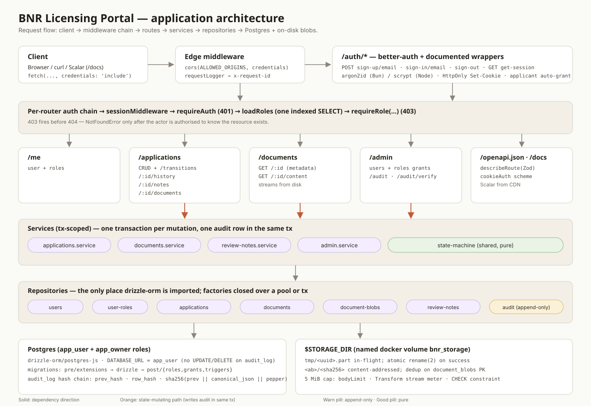
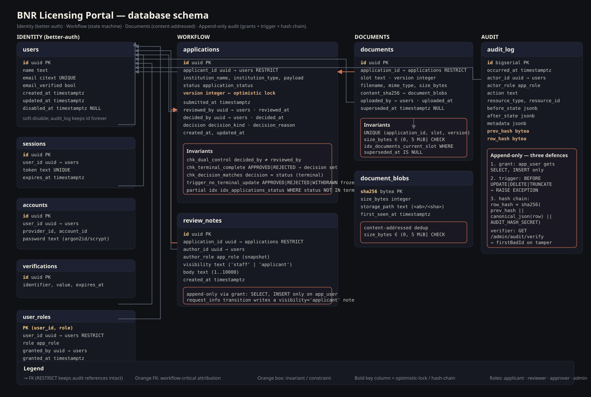

# BNR Licensing & Compliance Portal — design notes

A single-tenant portal: applicants submit licence applications, reviewers review, approvers decide, admins inspect a tamper-evident audit trail.

API docs (Scalar, served by the backend): <http://localhost:3001/docs>.

Read alongside the SVGs in [`docs/diagrams/`](./diagrams/).

## Why this tech stack

It's a solo build, so I optimised for **one language end to end and a small set of moving parts**. If this were a team project I'd let the team's familiarity drive the choice instead — what's below is what works best for me solo, not a universal recommendation.

### Monolith, TypeScript everywhere

One repo, one language, one type system shared between `backend/`, `frontend/`, and `shared/`. The state machine in `shared/` is imported by both sides, so the UI only renders actions the backend would accept. No service mesh, no schema sync chore, no context switching.

### Hono + Zod + OpenAPI

- **Hono** is built on Web `fetch` primitives — request and response are standards-based, so handlers are portable across Bun, Node, Cloudflare. Performance is solid and the middleware surface is tiny.
- **Zod** schemas double as runtime validators *and* OpenAPI components. One schema, no drift.
- **OpenAPI** is generated inline via `describeRoute`; Scalar renders it at `/docs`. Reviewers don't need Postman.

### Postgres 17

Most invariants belong at the data layer where the application can't lie about them:

- `CHECK` constraints for dual control (reviewer ≠ approver) and blob size
- Partial unique index for "one open application per applicant"
- Triggers to freeze terminal states and make `audit_log` append-only
- Two DB roles — `app_user` (runtime, no UPDATE/DELETE on audit) and `app_owner` (migrations only) — so a misbehaving handler physically cannot rewrite history

### Drizzle

TypeScript schema with real inferred types, real SQL migration files (no opaque ORM magic). Reads close to the SQL it generates, which matters when explaining audit guarantees.

### better-auth

Server-side sessions in Postgres, HttpOnly + SameSite=Lax cookies, Argon2id, drizzle adapter. Self-signup auto-grants the `applicant` role via a database hook; staff roles only come from an admin grant.

### SvelteKit + Svelte 5

SSR like Next.js, but a much smaller JS bundle shipped to the browser. Runes (`$state`, `$derived`, `$effect`) keep reactivity explicit. The browser never calls the backend directly — every request flows through SvelteKit server hooks, so the session cookie stays HttpOnly and CSRF is handled by better-auth's origin check.

## How the pieces fit




### Layers

| Layer | Job |
|-------|-----|
| Routes | HTTP shape, Zod parse, OpenAPI descriptors |
| Services | Transaction boundary, state-machine call, audit append |
| Repositories | SQL via Drizzle, predicated updates |
| Shared domain | Enums, state machine, pure functions, no I/O |

The rule: every state-mutating service runs inside `db.transaction(...)` and writes one `audit_log` row in the same transaction.

### State machine

`DRAFT → SUBMITTED → UNDER_REVIEW → READY_FOR_DECISION → APPROVED | REJECTED`, with `RFI_REQUESTED` as the clarification loop and `WITHDRAWN` as the applicant escape hatch. Approve/reject refuse when `actor.id === reviewedBy` (dual control). A pure function in `shared/` that both sides import.

Two deliberate quirks worth calling out:

- **`admin` is a break-glass role.** When the edge's role list doesn't match any of the actor's roles, `pickActorRole` falls back to `admin` if the actor holds it. So an admin can perform any transition, but dual control still applies — an admin who reviewed an application cannot then approve it.
- **`READY_FOR_DECISION` has no `request_info` exit.** Once an approver has the application, the only outcomes are `approve` or `reject`. If clarification is needed after that point, the approver rejects with a reason and the applicant restarts; the alternative is a queue that can churn indefinitely between reviewer and approver.

### Audit trail

Three independent layers:

1. **Grants** — `app_user` only has SELECT and INSERT on `audit_log`.
2. **Trigger** — `BEFORE UPDATE OR DELETE` raises.
3. **Hash chain** — `row_hash = sha256(prev_hash || canonical_json(row) || pepper)`. `GET /admin/audit/verify` walks the chain.

All three would have to fail at once for tampering to go undetected.

### Concurrency

Optimistic locking with a predicated update:

```sql
UPDATE applications SET ... WHERE id = ? AND version = ? AND status = ?;
```

Zero rows → 409 with `"refresh and retry"`. The audit insert uses `SELECT ... FOR UPDATE` on the chain tail, so concurrent transactions serialise and chain forks are impossible.

### Documents

Content-addressed by sha256, one slot per document type, 5 MiB cap enforced in three places (body-limit middleware, streaming counter, DB `CHECK`). Re-uploads supersede rather than delete.

## How the brief's non-negotiables are met

### 1. Auth & authorisation

- **Sessions, not JWT.** Server-side sessions in Postgres via better-auth. Revocable instantly (delete the row), no token-rotation choreography, HttpOnly cookies mean no XSS exfiltration. JWT only wins when you have to verify offline across services — that's not this system.
- **Four roles**: `applicant` (own applications), `reviewer` (review, request info, mark ready), `approver` (approve/reject), `admin` (roles + audit). Boundaries drawn around the workflow's actual hand-offs.
- **Backend enforcement.** Per-route middleware chain: `requireAuth → loadRoles → requireRole → requireVisibility → Zod`. The frontend uses the same state-machine function only to hide buttons; bypassing it still hits the same checks.
- **Reviewer ≠ approver.** Enforced in three places: the state machine refuses, a service guard refuses, and a Postgres `CHECK (decided_by IS NULL OR decided_by <> reviewed_by)` refuses. Belt, braces, and a second belt.

### 2. Workflow & state integrity

- **State machine** in `shared/src/domain/state-machine.ts` — pure function, exhaustive on event tags. Same module on both sides.
- **Illegal transitions → 409** at the API, never silently coerced. The service maps to `IllegalTransitionError`; `onError` returns `{ error: 'illegal_transition', from, event }`.
- **Final decisions are permanent.** Terminal states are sinks in the SM, and a `BEFORE UPDATE` trigger on `applications` raises whenever `OLD.status IN ('APPROVED','REJECTED','WITHDRAWN')` — every column, including `updated_at`. Stricter than "freeze the decision fields"; the row is immutable end-to-end once the decision lands.
- **Concurrent access.** Optimistic locking with a predicated `UPDATE … WHERE id = ? AND version = ? AND status = ?`. Zero rows → 409. Covered by `concurrent-transition.test.ts`: two `Promise.all`'d `mark_ready` calls produce exactly one 200, one 409, and one audit row.

### 3. Audit trail

- **Append-only**, enforced by three independent layers (grants, trigger, hash chain — see above). Even `app_owner` cannot UPDATE or DELETE without removing the trigger first, which itself would be visible.
- **Every row records** actor, action, timestamp, `before_state`, `after_state` (canonical-JSON full snapshots, not diffs — so a replay can reconstruct a deletion).
- **Legal-grade.** `GET /admin/audit/verify` walks the chain and returns `{ ok, lastVerifiedId, firstBadId, rowsChecked }`. Tampering with any column flips `row_hash`; truncation flips `prev_hash`. The pepper (`AUDIT_HASH_SECRET`) means the chain can't be silently rebuilt by anyone without it.

### 4. Documents

- **Upload + simulated storage.** Multipart upload streams to `$STORAGE_DIR/<sha[0:2]>/<sha>`. Metadata (name, size, MIME, uploader, timestamp, version) lives in `documents`; the file row lives in `document_blobs` keyed by sha256.
- **5 MiB cap, server-side**, enforced in three places: Hono body-limit middleware (cheap rejection on Content-Length), streaming byte counter (catches a lying client), DB `CHECK (size_bytes <= 5*1024*1024)` (last line).
- **Versioning.** One slot per document type; re-uploads supersede rather than delete (`superseded_at = now()` on the old row, new row at `version + 1`). Old versions stay accessible via `?include=all`.

### 5. API

- **Consistent error envelope**, mapped centrally in `onError`. No stack traces in responses — those go to logs only.
- **403, not 404, on unauthorised reads.** Middleware order enforces it: auth (401) → policy (403) → existence (404 only when the caller is authorised to know).
- **Documented.** OpenAPI generated inline from the same Zod schemas that validate. Scalar at <http://localhost:3001/docs>.
- **Reproducible seed.** `bun run db:seed` inserts one user per role, applications across the non-terminal states, and one audit row per seeded transition. No manual DB setup.

### 6. Frontend

- **Role-aware UI.** The shared state-machine function decides which actions render — the UI literally cannot show a button the backend would reject.
- **Loading / error / empty states.** SvelteKit `load` provides loading boundaries; errors map from the backend envelope to inline `<Alert>` or toast; empty lists render a deliberate empty state, not a blank panel.
- **End-to-end coverage.** `applications/[id]/+page.svelte` is the single workflow surface for every role: it imports the shared `transition()` function, walks `TRANSITION_EVENTS`, and renders only the buttons the backend would accept. A dual-control banner explains *why* approve/reject is hidden when the actor is the reviewer. `request_info` and the decision events have compose UIs (message / reason). Admin gets a dashboard (`/admin`) with totals, status breakdown, and live audit-chain verification; `/admin/audit` walks the chain; `/admin/users` manages role grants; `/admin/stuck` surfaces applications idle past an SLA.

## Trade-offs

- **Conscious omissions.** S3 storage (swap `backend/src/storage/index.ts`), OAuth/MFA (better-auth supports both), per-test DB isolation (currently one shared testcontainer, serial), PII redaction in audit snapshots, an applicant-facing notification channel for RFI events (today the applicant sees the note on next load).
- **The Bun/Node password-hasher split.** `Bun.password` at runtime, scrypt in Vitest. The single ugliest concession — a unified hasher would close it.
- **Admin as break-glass.** The state-machine fallback lets an admin perform any transition. Dual control still fences the decision, so the worst-case is an audit row attributing an unusual action to a named admin — visible, not silent. A stricter model would forbid admins from acting as reviewer/approver entirely and require role-handoff.
- **One shared test container, serial.** Cheaper than a per-test database; the audit hash chain and predicated UPDATE both serialise correctly, so cross-test bleed-through hasn't materialised. A per-test schema would be the next isolation step if the suite grows.

If this were a team project I'd revisit the runtime choice (Bun is fast but still rough around some Node packages), and probably swap the disk-backed blob store for S3 from day one.
